# SemantiCat: 大模型驱动的语义划词翻译插件

## Abstract

**摘   要**  本工作源于作者在学术文献阅读过程中对现有翻译工具的实际使用体验。针对文献划词翻译工具普遍存在的局限性——即仅对孤立文本片段进行机械翻译，缺乏上下文语义理解与交互式输出能力, 做出补充和发展. 本工作以大语言模型翻译与现有成熟划词翻译框架为基础，通过引入上下文语义理解模块与多模态信息处理机制，增强了系统对文献整体语境与跨模态内容（如图表、公式）的协同理解能力, 并在此基础上进一步提供了交互式问答功能，并特别集成了对 LaTeX 数学公式的识别与转换支持, 最终封装为一款轻量级浏览器插件。实验与实际使用表明，该系统在翻译速度较传统划词工具仅降低1%至5%的前提下，能够实现更准确、结构化且符合学术规范的翻译输出，从而为文献阅读与科研工作提供了有效的大模型驱动支持。

**关键词**  划词翻译; 语义翻译; 多模态翻译; 大模型应用; 翻译插件;


## I. Introduction

划词翻译，在狭义上指用户通过鼠标等交互方式，在网页或文档中选择特定词语或片段，系统获取选中内容后，利用机器翻译技术将其转换为目标语言，并通过可视化界面呈现结果的过程。近年来，随着机器翻译、光学字符识别（OCR）及交互技术的持续发展，划词翻译的功能边界已得到显著拓展：用户可对较长文本段落进行连续选择并实时获取翻译，选区的媒介范围也从传统支持系统原生划选接口的网页与可编辑文档，延伸至PDF、图像等原本不具备划选接口或无法直接进行划选的载体。这一演进不仅提升了翻译操作的灵活性与覆盖范围，也为跨媒介、跨格式的文本信息处理提供了新的技术支持路径。

相关工作已经提供了较为成熟的解决方案. 有道翻译, 沙拉查词等[1, 2]经典划词软件已经实现了在网页或文档等任何系统原生划词接口处进行翻译, 并可根据划词内容, 输出查词结果或是文段翻译; 知云文献翻译[3], hcfy划词插件[6]等将划词翻译应用到PDF文档中, 以侧边栏形式输出翻译结果; 文献管理软件zotero[7]也集成了翻译插件, 在PDF文献中划词并以悬浮窗形式显示翻译结果. 在一些功能全面的PDF阅读器中也已经支持了划选翻译, 如pdfelement, 福昕阅读器[4,5]等.

然而, 尽管上述工作已经提供了稳定成熟的解决方案, 但是大部分应用并不针对文献阅读和科研工作进行研制. 其存在多个仍需要补充的需求空缺. 由于多数文献以PDF形式进行保存, 故后续论证以阅读和翻译PDF文献或文档为基础展开. 

首先, 当前大多数集成于 PDF 阅读器中的划词翻译功能，其设计初衷主要在于为用户提供便捷的文本片段或词语的机器翻译结果。然而，在阅读学术文献时，面对篇幅较长、结构复杂，抑或跨越页面的连续性文本段落，现有的机器翻译往往仅能提供直译或基于预设领域语境的粗略润色。这种局限性使得文献翻译主要停留在语言转换层面，未能有效辅助用户深入理解文献思想。更甚者，由于划选范围的不当或翻译过程中的中断，可能导致翻译结果偏离原文意旨。

其次, 在自然科学与数学等领域，学术文献中蕴含的大量公式与符号信息对传统机器翻译构成了严峻挑战。现有的 PDF 划词翻译工具在处理选中区域内的符号或内联公式时，常将其错误地解析为乱码，严重阻碍了对原文的定位和阅读理解。此外，行间公式虽然通常不被主动选中翻译，但其视觉存在会干扰上下文内容的精确选取。在部分不支持断行选择的 PDF 划词翻译应用中，行间公式甚至可能被意外选中，从而生成大量无意义的乱码。

另外, 从更深层次的文献阅读需求出发，当前多数 PDF 划词翻译应用普遍缺乏记忆功能，用户的每一次划词翻译动作均是独立的，丧失了上下文的关联性: 用户无法回顾先前的翻译结果，翻译应用本身也无法将不同翻译片段的信息进行整合与比较。这种独立性使得在处理依赖前文定义或结构更为复杂的学术词汇时，机器翻译往往只能进行僵化或错误的输出。更进一步，相当数量的学术文献在段落结构上呈现出非直译友好的特征，例如包含分条列举或后置总结等叙事策略。此时，机器翻译的直译行为便会严重阻碍读者对原文精髓的准确把握与理解。

大模型或AI应用, 诸如OpenAI所提出的GPT系列, 或Google推出的Gemini系列提供了优秀的翻译能力, 目前相当多的工作已经结合大模型应用或是神经网络以拓展翻译能力的边界. 前述Zotero[7], hcfy划词插件[6]等, 开放了自定义AI翻译接口, 用户可自定义提示词, 而应用本身只作为显示AI输出内容的界面. Doc2X[8]基于Doc2X强大提取能力理解文档与图片里每一个细节, 提供PDF的全文档翻译转换, 并很好地处理了公式以及排版问题; Sider[9]提供将任何文档转化为互动AI聊天的能力, 具备上下文理解和记忆功能; 沉浸式翻译[10]主要针对网页中处理后的Html类型文献, 可基于原有格式排版的基础上进行翻译, 对公式符号等处理的较好.

然而，尽管上述提及的翻译应用在结合人工智能方面已取得显著进展，但其在满足学术文献阅读的灵活性需求方面仍存在明显的空白。开放式接口的设计使得应用本身主要承担显示界面的功能，然而，AI模型常返回包含 Markdown 和 LaTeX 混合格式的输出，而传统的划词翻译显示框未能有效处理此类复杂的排版, 对于伪代码或是实际代码的处理更需要定制化的显示接口进行兼容。全文档翻译或基于文档的交互式聊天功能虽然能够最大程度地实现全文的记忆与整合，但其高昂的时间与费用额度消耗，使其在仅需阅读文献特定部分（如摘要或结论）时显得不够高效与灵活。

此外，作为 AI 核心能力的提示词（Prompting）功能并未得到充分应用。当前多数 AI 翻译服务仍局限于满足原汁原味的语言转换需求，未能充分体现 AI 在理解能力、记忆与问答交互能力以及多模态信息整合能力方面的潜力。

基于此, 本工作提出以划词翻译为基础范式, 保持侧边栏显示翻译体系, 整合大模型语义和多模态能力, 提供从输入到输出的全方位整合的划词翻译应用, 并以浏览器插件形式封装, 达到轻量化且易于使用的目的. 

具体来说, 融合预设提示模板与用户自定义指令，结合用户划选的文本内容向AI发起请求。AI接收请求后，将依据指令完成翻译、原文内容整合、语序结构调整，并进行适当的概括与排版优化，最终将结果返回至前端界面。为实现内容的高质量呈现，系统针对AI返回的混合格式化文本（主要包含Markdown与LaTeX格式）进行了专门渲染，并保持良好的代码兼容性。考虑到翻译输出与原文对比的定位需求，本应用还支持从译文到原文的定位追踪功能。

应用具备上下文理解与记忆功能：用户每次划选的内容及其对应的AI响应，将按时间顺序存入一个容量固定的记忆池中，并在后续的翻译请求中自动携带该记忆信息以保持语义连贯。此外，系统支持交互式查询与多模态理解能力，用户可主动向AI发起询问，并支持上传图片作为输入。此类交互同样在记忆机制的支撑下进行，确保对话过程具有持续的上下文感知能力。

本工作的主要贡献列举如下:

- 提出融合上下文理解与记忆机制的大语言模型划词翻译框架，提升对学术术语和复杂句式的翻译准确度。
- 集成多模态处理能力，有效识别与转换LaTeX公式等专业内容, 支持图片翻译，改善科学文献翻译质量。
- 结合记忆与交互功能，支持用户针对翻译内容提问并自定义提示词，增强翻译灵活性与理解深度。
- 实现为轻量浏览器插件，在保持高效翻译速度的同时，良好兼容并渲染Markdown、LaTeX及代码等混合格式内容。

本文的后续结构如下, 第二部分将阐述本工作的整体架构, 包括前端, 后端以及AI交互的逻辑, 并对全部功能进行介绍; 部署和调试本工作相关源码的实验部分将在第三部分展开叙述; 最后阐述本工作的局限性以及未来发展远景.


## II. Framework

本项目架构围绕Chrome插件的基础需求展开, 主要包含前端, 后端, AI三部分. 

其中, 前端负责和用户交互, 并展示划词翻译内容, 同时负责捕获网页和本地的各类pdf文件; 后端针对pdf指纹对用户的问答记录进行记忆和储存; AI部分通过接口调用和提示词构建, 形成输入到输出的AI划词交互系统.


#### A. 前端部分

**(a) 前端构成**

前端由三部分组成, 分别为:

- 绿色: 由Vue3框架编写的侧边栏显示部分, 此为该应用的核心, 负责渲染AI输出, 提供交互输入
- 蓝色: 由开源阅读器pdf.js[12]修改形成的pdf阅读器部分, 此为阅读pdf, 捕捉各类pdf文件的核心
- 紫色: 由Vue3框架编写的阅读进度储存模块, 负责记录阅读和停留位置
- 橙色: 由Vue3框架编写的AI接口设置界面, 从插件小图标呼出, 可自定义模型以及提示词


需要注意的是, 虽然此处声明为前端, 但是它同时承担了AI request的相关任务, 这点需要和下文将要提到的后端相区分. 

侧边提示条和pdf.js存在于不同的结构中, 具体而言, Chrome插件框架的contentscript.js内容脚本创建了侧边条, 阅读器以及进度条三个组件, 并在检测到打开捕获文件的类型为pdf时, 

 **(b) 启动时Vue对pdf.js的信令交互**

**启动时,** 由contentscript.js发送构建询问信令, 体现为:

```js
if (document.contentType === "application/pdf") {
  chrome.runtime.sendMessage({ action: "canRequestBody" }, maybeRenderPdfDoc);
}
```

其通过Chrome提供的通信接口, 向同目录下pdfHandler.js发送消息

- pdfHandler.js是pdf.js提供的判断捕获pdf类型以及时机的脚本
- 捕获网页中的pdf打开动作并加载到阅读器中是相当复杂的逻辑, 我们在pdf.js的仓库中找到了解决方案[11], 并且进行了复用

当检测到pdf已经正确加载, 其返回确认, 体现为

```js
if (message && message.action === "canRequestBody") {
  sendResponse(canRequestBody(sender.tab.id, sender.frameId));
  return undefined;
}
```

- 返回确认将控制contentscript.js执行maybeRenderPdfDoc方法, 加载上述三个组件

**(c) 划词时pdf.js对Vue的信令交互**

**划词**是重要的功能, 仍然利用通信机制将pdf.js划到的. 在crx-viewer-main\content\web\selectionhandler.js中, 监听了鼠标左键动作并将划词内容抛出

```js
chrome.runtime.sendMessage({
    type: "SET_TEXT",
    vid: vid,
    text: processSelData.text,
    add: true,  // 添加状态
    hldata: processSelData.hldata
});
```

chrome.runtime的通信接口提供了跨框架的通信功能, 在vue-left-area\src\components\home.vue中, 我们监听了这个事件

```js
chrome.runtime.onMessage.addListener((message, sender, senderResponse) => {
    if(message.vid==='' ||  message.vid === this.vid){

        if(message.type === 'SET_TEXT'){
            console.log(`VUE[${this.vid}] SELECT TEXT: ${message.text.length} words`)
            this.onTextChange(message.text, message.add, message.hldata)
			...

        }
        ...
```

- 由于chrome.runtime通信是在整个Chrome中进行, 因此必须区分打开的页面编号

- 我们在maybeRenderPdfDoc方法中构建侧边栏组件时, 随机生成了vid并通过链接参数方式传递

- 同时, 这个vid会通过postMessage方式再次由阅读器抛出, 进行其内部通信, 由selectionhandler.js监听并记录vid, 至此, 全部组件确定了自己所负责的页面

  ```js
  //contentscript.js - maybeRenderPdfDoc
  let vid  = generateRandomStamp()
  ...
  vueIframe.src = chrome.runtime.getURL('gptcore/index.html'+"?ts="+vid);
  ...
  pdfViewer.onload = () => {
      // 现在 contentWindow 可用
      pdfViewer.contentWindow.postMessage({
          type: 'INIT_PDF_VID',
          vid: vid
      }, '*'); // 注意：'*' 允许任何目标 origin，生产环境应限制为具体域名
  };
  ```

  ```js
  //selectionhandler.js
  window.addEventListener('message', (event) => {
    if (event.data.type === 'INIT_PDF_VID') {
      vid = event.data.vid
      console.log(`PDF Viwer VID Confirmed! ${vid}`)
    }
    ...
  ```

需要注意, 在划词部分, 我们不仅抛出了文本, 还有其对应状态message.add, 以及位置信息message.hldata, 这些是为后续的追踪和多种划词方法的拓展打基础

**(d) 原文追踪时, Vue和pdf.js之间的信令交互, 以及range对象的序列化**

此处介绍**追踪**, 它和**注释功能**类似, 均实现了点击译文可以定位到原文的功能

- 本质而言, 我们点击侧边栏的一个组件, 需要pdf.js也做出响应, 这仍然是一个通信任务
- 需要记录每个条目生成时, pdf所处位置, 在pdf的处理中被描述为一个`range`对象
- 由于对象不能进行通信, 我们还应用了对象序列化和反序列化的技术使其可以兼容通信框架

**追踪时,** 用户在侧边栏点击生成的条目, 触发vue-left-area\src\components\home.vue中的handleHlClick监听函数, 它将标记为PDF_HIGHLIGHT的消息包括序列化的hl信息抛出

```js
chrome.runtime.sendMessage({
    type:'PDF_HIGHLIGHT', 
    vid:this.vid,
    hl:JSON.parse(JSON.stringify(hl)),
    hl_type:htype,
})
```

在crx-viewer-main\content\web\selectionhandler.js中监听了这个消息, 由highlight函数执行, 它主要是处理其中携带的hl信息并生成原文所在的页面以及位置, 并控制阅读器滚动到相应位置

- 这依然是较为复杂的逻辑, 我们在pdf.js的实现crx-viewer-main\content\web\viewer.mjs中找到了移动阅读器的部分并复用
- highlight函数会生成一个短暂出现的指示框表示原文位置
- 在**注释功能**中, 用户点击注释条后, 会沿用同样逻辑使阅读器跳转, 指示框会常显而不是消失, 故不再阐述

```js
chrome.runtime.onMessage.addListener((message, sender, senderResponse) => {
  if (message.vid === vid && message.type === 'PDF_HIGHLIGHT') {
    highlight(message)
    ...
  }
```


#### B. AI功能部分

**(a) AI接口参数设置**

AI功能主要由侧边显示条中的相关逻辑承担, 并由Chrome框架中小图标入口运行的crx-viewer-main\settings\index.html文件进行接口设置, 它由crx-viewer-main\manifest.json中的如下内容定义

```json
"action":{
    "default_popup": "settings/index.html"
},
```

此链接指向由Vue编写的设置页面编译出的html单文件, 并在全局起作用

**设置时,** 由小图标呼出弹窗, 输入模型, apiUrl, 以及apiKey后, 也可以附加自定义提示词, 点击Save储存设置

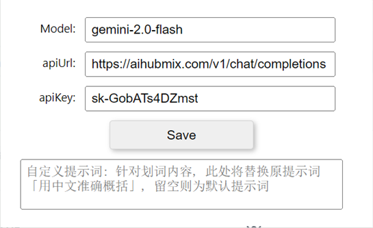

- 需要注意, 确保apiUrl的服务提供商采用了OpenAI接口, 由于本项目编写时尚未考虑其他类型接口, 因此, 确保服务商AI请求满足以下格式:

  ```js
    this.$axios.post(this.apiUrl, {
      model: this.gptModel,
      messages: [
        {
          role:"developer",
          content: ""
        },
        {
          role:"assistant",
          content:""
        },
        {
          role: "user",
          content: ""
        }
      ]
    }, 
  ```

设置内容的储存使用了Chrome插件所提供的chrome.storage.local.get, chrome.storage.local.set接口, 其将用户的设置存于浏览器中, 并作用于全局, 在插件的作用域中, 均可以直接使用上述两个接口获取设置.

**(b) AI调用逻辑-划词**

和AI的划词交互是本工作的核心

所有的**预设提示词**可以在vue-left-area\src\components\home.vue中的callAIResponse方法找到, 这是侧边条收到用户划词内容后, 将文本处理后, 进行AI调用的入口

首先, 经由chrome.runtime.onMessage监听到的SET_TEXT类型信令携带划词内容, 将原划词文本交付this.onTextChange方法进行处理

处理文本的目的是

1. 判断用户是否误选, 即单次选择字数低于50或高于3500, 会提示用户误选, 由用户确定是否继续AI调用
2. 删除连字符, 替换连续空格, 替换*, /等容易和markdown语法混淆的符号

随后, 利用axios发起请求, 并得到返回结果, 这个过程可以被用户阻断, 但是发出的请求仍然会扣除额度

对于返回的内容, AIoutputProcess会再次处理, 替换其中干扰markdown渲染的部分, 保证最佳可视效果

**对于Latex公式**, 我们进行了特别处理, 尽管读取划词的原文可以看到选中的符号和公式为纯文本显示, 并没有区分角标等信息; 因此, AI可能会出现混淆上下标的情况


另外, 部分公式选中后为乱码, 但是有理由认为这些字符只是一种没有经过良好编码和显示的公式, 它仍然包含公式的信息, 因此, 大模型可以识别并将其转换为Latex格式

- 由于具有上下文记忆功能, 因此这种识别比单纯的光学符号识别更加准确
- 我们使AI有意区分行间和内联公式两种, 并采用了不同的方式渲染
- 针对每个公式和符号我们储存了它的原始代码, 并可通过点击进行复制


**(c) AI调用逻辑-图文问答**

问答是在AI划词整合翻译, 以及具备上下文记忆能力的基础上衍生出的附加功能

初衷是方便用户进行问答, 尽管相当多的AI应用已经可以实现基于pdf全文的阅读问答, 但是在开发这项功能时, 前述并不普遍

我们默认以OpenAI的gpt-4omini作为视觉基础, 如果要更改这个, 请在home.vue中的data()内进行修改

```json
gptModel:"gemini-2.0-flash",
gptModelVision:"gpt-4o-mini",
```

其中, gptModel跟随用户设置, 而gptModelVision则是视觉模型

**在问答时**, 用户点击侧边栏底部的问答输入框, 呼出并输入问答内容, 随后, 其遵循和划词翻译相同的问答范式

- 提示词不同, 在vue-left-area\src\components\home.vue的handleAsk方法中可以进行修改
- 它不遵循用户自定义提示词

图片以base64编码形成文本被嵌入在问答中, 符合OpenAI的接口调用规范

键入图片后, 我们会计算图片大小信息以方便用户估算额度消耗, 一般来说, gpt-4omini并不会消耗较大额度


#### C. 后端部分

由于Chrome插件的性质, 其基本上被隔离在浏览器这个类似沙箱的环境中, 并不具备和PC本地文件进行交互的权限

如果要使插件产生一些记忆, 例如用户先前问答的内容, 以及注释内容, 序列化后的json需要被保存

- 因此, Chrome的性质导致, 如果要储存这些内容, 它只允许用户储存在浏览器中
- 尽管浏览器会处理和本地的交互, 但这对我们是不可视的
- 一些资料表明, Chrome的浏览器储存有大小限制, 并且会被某种机制触发清理

储存在本地是最好的选择, 而能与PC交互的最佳接口便是127.0.0.1:xxxx环回通信

**python-fastapi后端通过127.0.0.1:8225端口和前端进行通信**

1. vue-left-area\src\components\home.vue将其图片, 用户问答记录序列化后, 交付后端进行本地储存

   储存文件名: {pdf_fp}.json

2. pdf-bars\src\components\home.vue中监听UPDATE_PROGRESS信令并将阅读位置交付后端进行本地储存

   储存文件名: {pdf_fp}_ops.json

如何区分不同源得到的pdf是否为同一个文件, 起初我们打算使用图像对比, 即针对第一页和最后一页渲染的内容进行比对, 然而这种方法非常低效

最终, 在 crx-viewer-main\content\web\viewer.mjs 中, 我们找到了解决方法:

- 其中, load方法中, firstPagePromise的回调中, 出现了一个叫pdfDocument.fingerprints[0]的变量
- 它就是根据pdf第一页内容计算出的某种“指纹”, pdf.js官方使用它来标记相同内容的pdf文档
- 我们将其利用内部通信抛至上层, 上层广播将fp分发给所有子组件

```js
window.top.postMessage({type:'PDF_FP', fp:pdfDocument.fingerprints[0]}, '*')
```


## III. Experiment

#### A. 使用该插件

**Step1: 安装插件**

在Chrome浏览器中, 直接将最新release的.crx文件拖入拓展管理器, 即可安装该插件

由于没有上架谷歌商城, 因此新版本Chrome可能会阻止这一操作, 以下两种方法供参考

1. clone源码, 在拓展管理器中打开开发者模式, 直接将crx-viewer-main拖入其中
2. clone源码, 拓展管理器中点击`打包扩展程序`, 选择crx-viewer-main并生成新的.crx, 它可以直接安装

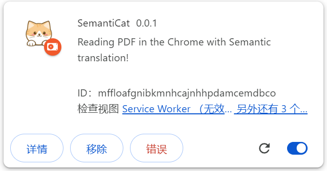

上述图像表明安装成功, 点击详情, 打开“允许访问文件网址”, 随即可以使用

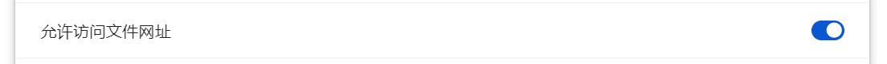

- 在任意文献页面打开pdf, 或是将本地pdf拖入浏览器, 它会自动捕获

<u>点击小图标入口, 填写模型, 服务商以及key,</u> 我们推荐aihubmix的服务, 若自己拥有满足OpenAI请求格式的服务商, 也可以尝试使用.

**Step2: 打开后端**

进入SemantiCat-Github\pdf-backen\dist\PdfBacken\PdfBacken.exe将其打开

- 后端无感运行, 双击后可在任务管理器确认PdfBacken进程是否存在, 存在即运行成功

- **推荐设置开机启动**, 将其快捷方式放置于C:\Users\用户名\AppData\Roaming\Microsoft\Windows\Start Menu\Programs\Startup 实现开机启动

  

---

**(a) 划词翻译功能**

大多数时间, 我们阅读文献并不需要双手并用, 因此基础功能映射到了鼠标左右键的组合, 这提高了效率

1. **按住左键**在pdf阅读器中划选一段, 侧边栏显示“Wait”即开始AI请求, 随后, 返回的结果会被渲染并以条目形式追加

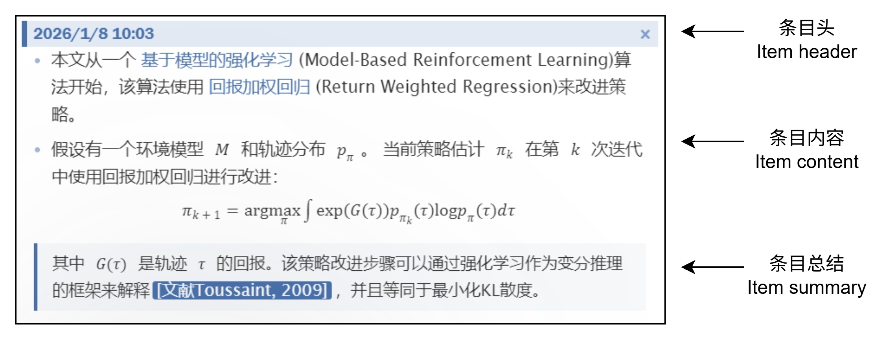


2. 在侧边栏显示“Waiting”期间, **按住右键, 再点击左键**, 则阻断本次请求, 显示“Cancel”

   注意, 这只是在通信层面上阻断, 实际请求仍然是会被发送到服务商, 并扣除额度

   注意, **按住右键, 再点击左键**是我们通用的“取消”动作


2. **按住左键划选, 不要松开左键, 此时按下右键**, 实现多段选择

   这个功能针对跨段, 跨页, 跨元素的文字选取

   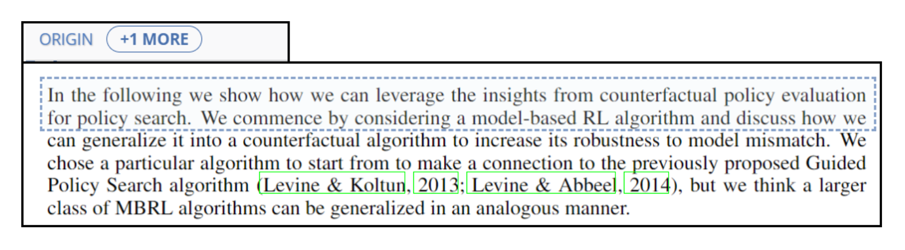

   点击**左上角**的“+1 MORE”, 或是此时**按住右键, 再点击左键**, 会清空多段选择

   在最后一段需要追加的内容划词结束后, 直接像普通划词一样松开左键, 系统会整合多段内容一同发起请求

   

3. **按住Ctrl, 进行普通划词**, 为复制原文模式

   被选中文段会显示绿色指示框, 此行为不会发起请求, 只会将原文复制

   同样, 在左上角点击“ORIGIN”会展开原文框

   - 若**关闭原文框**(默认), 在每次划词结束后, 原文会展示在原文框中

   - 若**打开原文框**, 划词不会产生请求, 而是将原文展示在原文框中

     

5. 点击左侧的结果**条目头**, 会控制阅读器到达原文位置, 并以蓝色指示框标记

   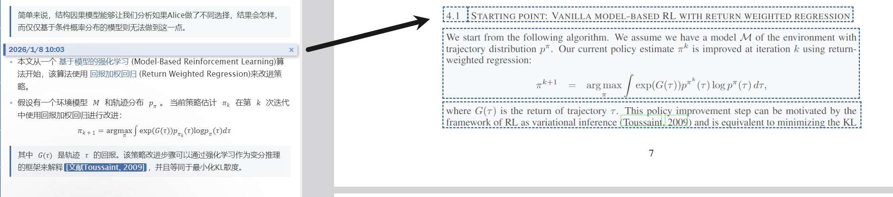

6. 点击左侧的结果**条目头中的“X”**, 可以删除这个条目

7. 条目中的任何元素都可以交互

   鼠标放置在可交互元素上, 其底色会发生改变, 双击该元素, 会将内容复制

   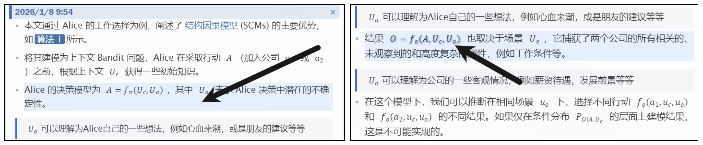

   公式元素比较特别, 鼠标放置其上时, 会出现手型并且出现蓝色底色, 此时直接点击公式, 会复制latex代码

   

**(b) 问答功能**

问答功能拓展了划词翻译的能力范围, 发挥了大模型的能力

1. 在侧边栏左下角的输入框, 点击可拉起, 随意输入内容后, **按下Ctrl+Enter**可发起问询

   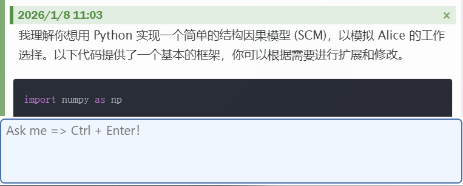

   - 这种问询仍然可以被阻断, 方法同上, 但依旧会消耗额度

   - 并非流式返回, 因此需要等待AI将消息全部输出后, “WAIT”标识才会结束, 并渲染内容, 由于AI消息长度不定, 因此请耐心等待, 如果耗时较长, 请阻断并检查F12中控制台是否报错

     

2. 对前面的条目按下**鼠标中键**可进行引用

   - 对条目头进行鼠标中键, 可实现整条引用
   - 对条目元素进行鼠标中键, 只会对元素内容(包括子元素)进行引用

   引用后, 会以“quote +x”的方式表示, 点击这个“quote +x”, 可以消除所有引用

   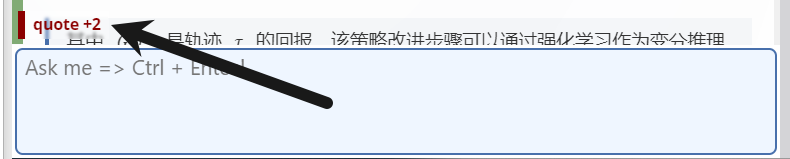


3. 截图并复制到剪切板, 或是复制图片文件后, **直接在输入框粘贴**, 进入图文问答模式

   

   - 紫色部分表示传入图片的大小, 请不要上传较大的图片防止其消耗较多额度

   - 设计初衷是为了AI能够解读文献中的图表, 因此每次上次数量为1, 上传新的图片会顶替旧的图片
   - 点击紫色部分, 可以消除图片上传返回普通模式

4. 问答部分的条目头是不能点击的, 只可以点击“X”进行删除


**(c) 注释功能**

注释功能只适用于简单的备忘, 并不是设计用于复杂的笔记或是思维管理

如需要复杂的思维管理, 请使用专业软件

1. **按住Alt+普通划词**, 被划选部分出现红色指示框, 左下角输入框弹起, 进入注释模式

   输入注释内容, Ctrl+Enter确认注释, 红色指示框停留

   若点击任意其他地方, 则取消注释, 输入框收起, 红色指示框消失

   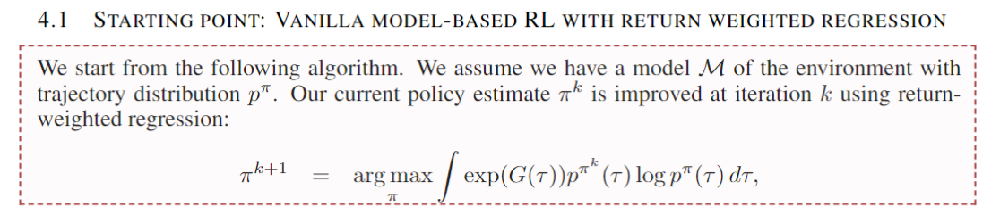

   确认注释后, 侧边栏追加注释条目

   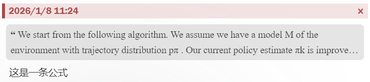

   **此处有两个元素可以交互**

   - 条目头可以点击, 和划词翻译一样会定位到注释位置

   - 灰色的原文框可以点击, 会复制原文

     

2. **注释时, 直接将剪切板图片粘贴**, 可以实现图片注释

   这直接复用了图文问答的逻辑

   

   图片通过后端储存在本地, **当注释被删除时, 图片同样会被删除**


3. **按住Alt, 在任意条目内容上划选**, 实现高亮注释

   这种注释不能输入文本, 只用于高亮

   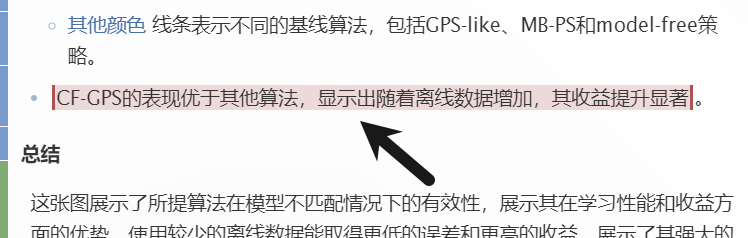

​	**按住Alt, 点击高亮注释, 会删除这个高亮**


**(d) 阅读进度功能**

这是一个小功能, 用于跟踪阅读状态

1. 左侧, 我们将条目分为三类, 并赋予不同颜色

   - 蓝色: 划词翻译条目, 意为“Input”
   - 绿色: 问答条目, 意为“Feedback”
   - 红色: 注释条目, 意味“Output”

   在最左侧的彩色竖条展示了整体视图, 

   - 彩色竖条可以点击, 定位到相应条目位置
   - 黑色三角表示当前阅读位置
   - 红色三角表示高亮注释位置

   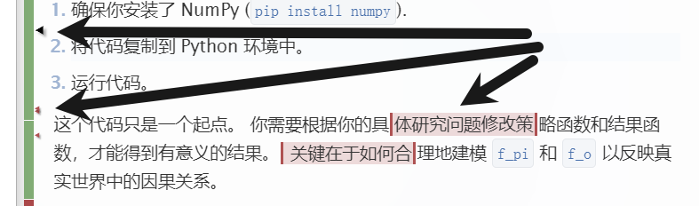

2. 侧边栏右上角, 显示各种条目的比例

   

   良好的文献阅读习惯, 请避免Input始终占据较大比例, 请适当进行询问和注释, 边思考边阅读


3. 右侧, 透明度块条记录阅读者停留的位置和时间

   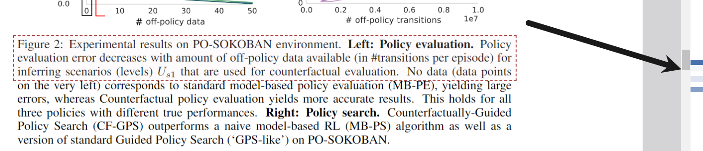

   它将整个pdf分档高度划分为100块, 根据滚动条停留位置, 对当前位置块的透明度每次增加一个常量

   如果该块透明度到达1, 则后续每次增加时, 会重新归一化, 视觉上体现为其它块的透明度下降

   **当Chrome处于后台时, 透明度条不会改变**


**(e) 清空指令**

在vue-left-area\src\components\home.vue的handleAsk方法中定义

```js
if(this.askContent.includes("@Clear")){
    const isConfirmed = confirm(`你确定要删除这 ${this.ai_res.length} 条记录吗？`);
    if (isConfirmed) {
        this.$axios.put('/clear_all', {
            fp: this.pdf_fp,
        })
```

**在问答框输入“@Clear”, 并Ctrl+Enter , 会出现提示删除记录**

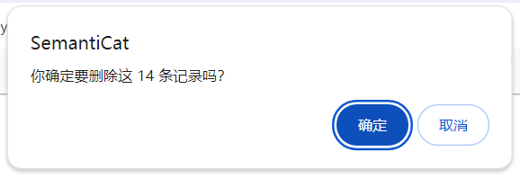

如果点击确定, 则会清空当前pdf文档的全部问答包括注释, 以及阅读进度


#### B.开发该插件

插件含有五个部分

| 工程                        |       功能       |    语言    |
| :-------------------------- | :--------------: | :--------: |
| ai-settings                 | 小图标AI设置界面 | Vue3 +Vite |
| crx-viewer-main             |    插件主框架    |  js, html  |
| crx-viewer-main\content\web |  pdf.js开源内容  |  js, html  |
| pdf-backen                  |       后端       |   python   |
| pdf-bars                    |    阅读进度条    | Vue3 +Vite |
| vue-left-area               |  侧边栏核心框架  | Vue3 +Vite |

对于vue的项目, 均可以在编辑后使用如下指令进行编译

```
npm run build
```

编译后, 会产生html文件, 按照如下路径放置编译的index.html和assets文件夹:

- crx-viewer-main\gptcore\\: 放置vue-left-area编译结果
- crx-viewer-main\pdfbar\\: 放置pdf-bars编译结果
- crx-viewer-main\settings\\: 放置ai-settings编译结果


对于python后端, 编辑后, 请使用pipenv虚拟环境 

1. 确保安装了pipenv虚拟环境

   ```
   pip install pipenv
   ```

2. 在虚拟环境中, 安装需要的包

   ```
   pipenv shell
   ```

   ```
   pip install -r requirements.txt
   ```

3. 在虚拟环境中, 启动打包

   ```
   pyinstaller PdfBacken.py -D
   ```

   随后, 在pdf-backen\dist\PdfBacken中产生打包后的文件PdfBacken.exe以及_internal文件夹

   - 在_internal\save下储存所有的pdf问答和阅读进度记录
   - 在_internal\static下储存所有的图片


## Conclusion

显然, 我以整活的方式撰写了这个README.md, 里面有诸多表述不清晰的地方, 因此, 请不要着急攻击, 因为开源这个项目距离我完成编写已经过去了数月, 很多东西我都不记得了, 在编写这个README时, 我不得不重新翻阅难以阅读的源码, 并补上一些注释

我承认, 很多代码写的相当简单粗暴, 因为一开始并没有考虑开源或是有其他人使用, 在一些功能的实现上干脆采用了hardcode, 命名和注释也有很多不规范的地方, 但总归来说, 它是能运行的, 我个人也用了很久以保证它的可靠与可用性, 才打算开源出来

我并不是一个擅长探索发掘各种好用的软件或者工具的人, 读研的头几天, 就有各种课程或是各种同学向我推荐好用的文献阅读或是文献管理工具, 有些是收费的, 有些则是免费的, 然而, 在经过几番尝试后, 我终究难以适应那些软件, 例如zotero, 它很优秀, 但是面对越堆越多的文献, 我的阅读量远远小于搜集量的时候, 焦虑席卷了我并使我删除了这个软件

也因此我发现, 我并不想保管那么多的文献pdf, 更多的时候, 我只想阅读某些文献的一部分, 它们如果能给予我灵感, 那么我会用笔记的方式记录

划词翻译是很适合我的一种模式, 一开始是知云, 但是它需要我把pdf下载下来, 再拖进去使用, 而且每隔一段时间就要重新登录, 相当难受, 后面发现了hcfy插件, 它具有和知云一样的功能, 只是不需要你登录, 而且它是一个插件, 可以捕获在IEEE Xplore或者其他文献网站中打开的pdf, 这用起来舒适多了

Doc2X是一个很优秀的pdf转换器, 它能把pdf全文翻译并转为网页, 再使用沉浸式翻译进行阅读, 这样的组合也很好, 但是它耗时间, 而且需要一些资金消耗, 尽管并不是什么大笔开支, 但这对于日常阅读来说并不是一个正反馈.

我用hcfy了很久, 它很简单, 却很好, 遇到很好的文献, 我就下载下来并且用文件夹分类的方式管理, 这很适合我, 尽管这像极了山顶洞人

直到某一天, 我闲来无事翻看hcfy插件的设置, 发现它支持AI接口, 我填入了购买的AI代理, 就用简单的gpt4omini, 提示词也只是简单的“请帮我把内容翻译为中文”, 就这样, 在插件界面的封装下, AI以看不见的方式工作, 扮演着和机器翻译一样的角色, 但是我得到了更为自然而且符合语境的翻译结果

就这样, 我又使用了一段时间, 从体验上出发, 我想要AI帮我在翻译结果后面附加上对于其中的专业术语以及公式符号的解释, 只需要简单修改提示词, 它就做到了, 然而, 由于hcfy的显示界面只是为了机翻结果准备, AI很喜欢输出markdown和latex, 我不得不在提示词中让他不要用这种格式输出

但是, 它明明是AI, 它能做到更多, 我不应该这样束缚它.

恰好那段时间, 我在另一个工程上学习到了Vue开发, 以及结合fastapi的全栈工作, 另外我又学习到了markdown和Latex的渲染, 那么一个想法呼之欲出, 即, 我亲自开发一个插件, 它可以实现我想要的全部功能, 彻底解放AI的能力, 因此, 就有了现在这个项目

它经过了很多很多次迭代, 尽管用户只有我一个, 我在阅读文献的同时, 记录自己使用时的需求, 并更新它

它遇到了很多难点, 从简单的显示排版, 到pdf的捕获, 以及pdf.js和Vue的交互通信, 我相当感谢pdf.js团队的一名主要开发者在Stackoverflow中谈起当时解决pdf捕获的想法, 这给我了很大帮助. 另外, 相当多的功能是在AI的辅助下完成的, 最终, 我完成了这个工作, 并且, 我用了很久.

现在的它, 可以输出相当自然的文段翻译以及总结, 在提示词的调控下, 我认为很多时候它的输出非常人性, 这使我阅读了超过平时的文献, 并且乐在其中, 最终它也帮助了我形成了自己的文献管理方式和阅读习惯, 我只需要用它, 配合typora进行笔记记录, 就已经可以支撑我全部的科研需求.

我很欣慰能和AI这样一个没有情感的计算机程序一同协作, 它辅助我的开发, 并且在此过程中我学习到了很多知识, 而我将它融入了我想要的划词翻译中, 让它不再束缚于简单的textarea中, 最终形成的作品让我工作和研究更加顺利, 这样的相互成就令我至今感慨万千. 

但是, 如果作为一个要交给他人使用的产品, 它依旧有很多缺点, 

首先, 有一些体验上的bug, 例如输入框回弹的时机,  还有注释有时会干扰显示等等, 但这对于我个人使用是完全足够的, 它们并不会一直触发

其次, 例如图片只能上传一张, 或是图文问答不会显示用户上传的图片这种让人有些“缺少信息”的缺点, 或许未来某一天会补足

还有, 在当时开发时, gpt4omini是一个很好的视觉模型, 然而现在有相当多超过它的视觉模型, 我或许应该开放它的自定义设置

以及, 现在AI已经支持多模态输出, 例如图片输出, 也许我可以加一个问答的图片输出, 还有AI结果的流式返回, 我始终没有尝试去做这个功能.

总之, 它还有很多进步的空间, 但请注意, 它只是一个帮助阅读文献的工具, 真正阅读文献则需要自己的努力, 它不能替我完成这些事情, 这也是我没有再消耗更多精力去开发它的原因.


## Reference

[1] 有道划词翻译 https://cidian.youdao.com/5.0/help/deskdict5beta/description/09.html

[2] 沙拉查词划词翻译 https://saladict.crimx.com/native

[3] 知云文献翻译 https://www.zhiyunwenxian.cn/

[4] pdfelement https://pdf.wondershare.net/

[5] 福昕PDF阅读器 https://www.foxitsoftware.cn/pdf-reader/

[6] hcfy划词翻译插件 https://www.hcfy.ai/

[7] zotero划词翻译插件 https://www.zotero.org/, https://github.com/windingwind/zotero-pdf-translate

[8] Doc2X https://doc2x.noedgeai.com/

[9] Sider https://sider.ai/

[10] 沉浸式翻译 https://immersivetranslate.com/zh-Hans/

[11] pdf.js捕获pdf文件解决方案 https://stackoverflow.com/questions/27770677/chrome-extension-how-to-show-custom-ui-for-a-pdf-file

[12] pdf.js开源内容 https://mozilla.github.io/pdf.js/getting_started/